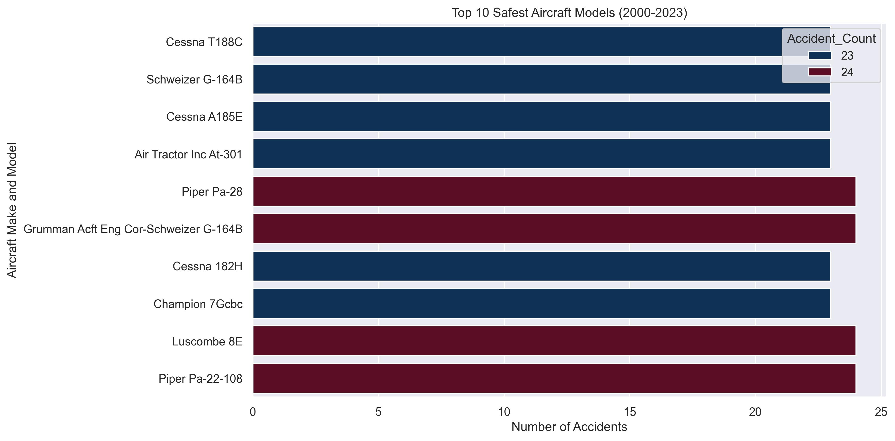
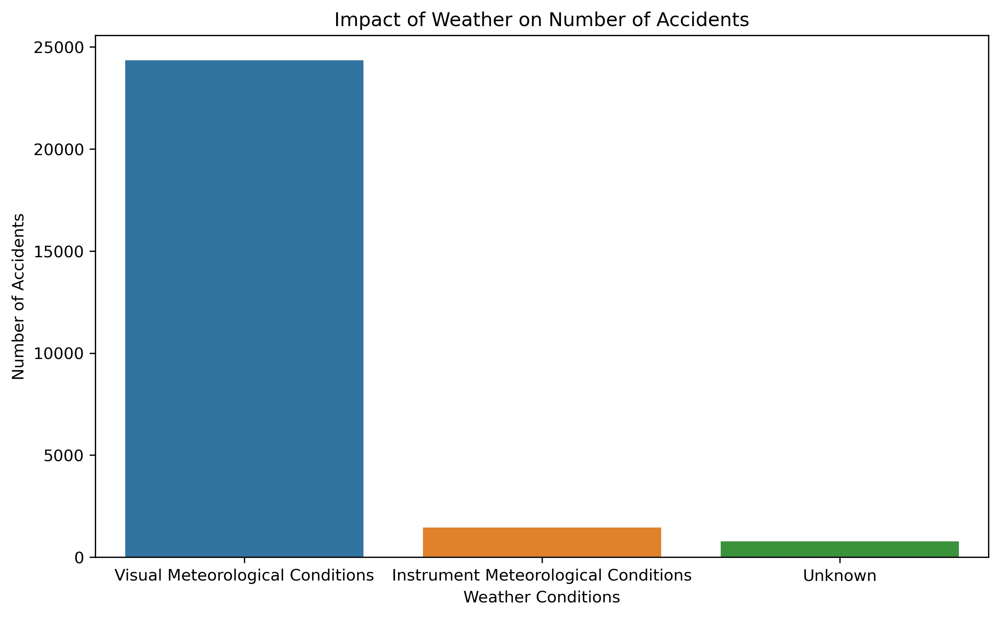
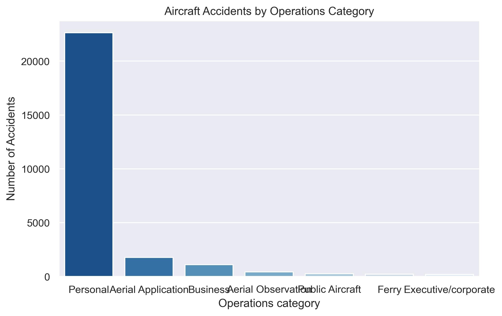

# 1.0 **Project Title: Risk Assessment for the Operations of Private and Commercial Aircrafts**
### ***Author:*** Patrice Okoiti

## 1.1 **Overview**
This project is designed to provide data-driven insights into the operations of private and commercial flights in the aviation industry. It is intended as a resource for the board of directors of Umoja Logistics to enter the aviation sector, focusing on private and commercial operations. The project will help them understand the various risk factors associated with the industry. It will act as a guide for selecting the most suitable operations category and the safest aircraft.

## 1.2 **Data Understanding**
The selected Dataset https://www.kaggle.com/datasets/khsamaha/aviation-accident-database-synopses for this analysis is from the National Transportation Safety Board, available on Kaggle, detailing the civil aviation accidents and selected incidents in the United States and international waters between 1962 and 2023. It details aircraft accidents, including information on accident, aircraft specifications, weather conditions, and injury severity which are relevant to this analysis.

### 1.2.1 **column description**

| **Columns** | **Description** |
|-------------|-----------------|
| Event Id, Accident Number, Event Date, Location, Country, Latitude, Longitude, Airport Code, Airport Name | Unique identifiers for each accident and its location. |
| Make, Model, Aircraft Category, Amateur Built, Number of Engines, Engine Type | Details about the aircraft involved in the accident. |
| Injury Severity, Aircraft Damage, Weather Condition, Broad Phase of Flight | Risk factors contributing to the accident. |
| FAR Description, Schedule, Purpose of Flight, Air Carrier | Type of operations and flight purpose. |
| Total Fatal Injuries, Total Serious Injuries, Total Minor Injuries, Total Uninjured | Casualties per accident. |

-***Features:*** The most important features relevant to the analysis from the dataset include unique identifiers of aircraft, that is, Make, Model, Date and risk factors associated with aircraft accidents, that is, Weather Conditions, Broad phase of flight

-***Target:*** The target audience for this analysis is the board of directors of Umoja Logistics and any other organisation who looking to diversify their portfolio by venturing into aviation industry, particularly operating private and commercial aircrafts.

## 1.3 **Business problem**
Umoja Logistics is diversifying their portfolio by venturing into the aviation industry. The aim is to purchase and operate aircraft for commercial and private enterprises. However, aviation involves significant safety risks, including accidents and operational hazards. The goal of this project is to analyze historical aircraft accident data to identify low-risk aircraft models and key risk factors that could impact operations.

## 1.4 **Objectives**
1. Identify the safest aircract model  - This involves analyzing the number of accidents based on aircraft 'Make' and 'Model' to determine the aircraft with the lowest risk of accidents.
2. Identify risk factors contributing to aircraft accidents - This involves tracking accident trends over the last 23years, impact of weather conditions and phase of aircraft when most accidents occur.
3. Evaluate operational risks - Compare number of accidents between aircrafts for private operations and commercial operations.

## 1.5 **Method of Analysis**
1. Descriptive Statistics: Summarizing the accident counts based on aircraft model, risk factors and operations of the aircraft.
2. Data visualisation: Use of bar charts and line charts to visualize the above descriptive statistics.
3. Risk Assessment: Identify risk factors associated with number of accidents of the aircrafts.
4. Interactive Dashboard: https://public.tableau.com/views/learn-project-03-28-25-PO/Dashboard1?:language=en-US&publish=yes&:sid=&:redirect=auth&:display_count=n&:origin=viz_share_link

## 1.6 **Key Findings**

1. The following chart shows the safest aircrafts based on lowest number of accidents for private and commercial flights:

2. The following chart shows that most accidents occurred under VMC(Visual Meteorological Conditions):

3. The following chart shows that venturing into private flight operations is riskier than commercial flights operations:

## 1.7 **Conclusion**

From the analysis of the Aviation Data it be can concluded that:
- The aircrafts with the high number of accidents may be due to high levels of usage
- Adverse weather conditions is a significant risk factor in aircraft accidents but it has not been the primary risk factor in the 21st Century.  
- The phase the aircraft is in when accidents occur remains majorly unknown, but a significant number of accidents often occur during landing, taking off and cruising making them significant risk factors.
- Prioritizing operations of commercial flights is more viable as compared to private flights due to the high number of accidents encountered by private flights

