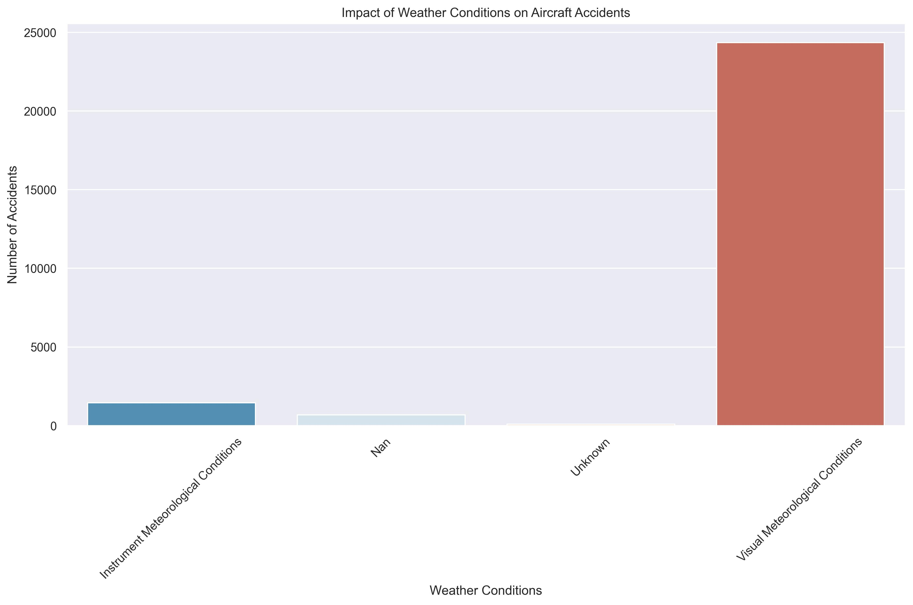

# **1.0 Project Title: Risk Assessment for the Operations Of Private and Commercial Aircrafts**


[](https://opensource.org/licenses/MIT)

## 📊 Project Overview

A comprehensive data analysis platform for assessing risks in private and commercial aviation operations. Built for Umoja Logistics to support strategic decision-making in their aviation sector expansion.


## 🔍 **1.0 Business Understanding**

In the aviation industry, safety and operational efficiency are paramount. Airplane accidents can result in tragic loss of life, financial damages, and reputational harm to airlines and regulatory bodies. As the aviation sector becomes more data-rich, there is an opportunity to harness historical accident data to identify patterns and factors contributing to fatal incidents. This project aims to analyze aviation accident data to generate actionable insights and build a recommendation system that helps stakeholders, such as Umoja Logistics, to mitigate risk and improve flight safety. By leveraging data-driven recommendations, organizations can make informed decisions on aircraft procurement, flight routing, and maintenance scheduling.


### ⚠️ **1.1 Challenges** 

Key challenges include:
- Identifying the aircraft models and categories most associated with fatal accidents.
- Understanding the influence of weather, flight purpose, and location on accident severity.
- Dealing with missing or inconsistent data in historical records.
- Ensuring interpretability of insights to support actionable decision-making.
- Differentiating between causal factors and correlated patterns.


### 💡 **1.2 Proposed Solution**

Conduct a comprehensive analysis of aviation accident records to:
- Explore accident frequency and injury severity across aircraft categories and flight purposes.
- Evaluate temporal and geographic trends in accidents.
- Engineer risk-related features such as severity scores and fatality flags.
- Visualize the correlation between weather conditions and fatal outcomes.
- Provide a data-driven recommendation system that highlights safer aircraft choices, high-risk regions, and optimal conditions for flight operations.


### ✅ **1.3 Conclusion**

By analyzing aviation accident data, organizations can proactively reduce operational risks, enhance safety protocols, and optimize decision-making. The resulting recommendation system will help stakeholders adopt more informed strategies in aircraft deployment and risk management.


### 📌 **1.4 Problem Statement**

Umoja Logistics seeks to reduce its risk exposure from fatal aviation incidents. The company currently lacks an evidence-based system to guide decisions related to aircraft acquisition, routing, and flight scheduling. By leveraging historical accident data, the organization aims to identify high-risk factors and adopt best practices to ensure safety and efficiency.


### 🌟 **1.5 Objectives**

1. To examine the relationship between aircraft type, flight purpose, and injury severity.
2. To explore spatial and temporal trends in aviation accidents.
3. To identify the most critical variables linked to fatal outcomes.
4. To generate actionable recommendations for safer flight operations.


## 📊 **2.0 Data Understanding**

In this phase, we'll examine the NTSB aviation accident dataset in detail to understand its structure, quality, and potential for addressing our business objectives.

### 🌐 **2.1 Data Source**

The selected Dataset https://www.kaggle.com/datasets/khsamaha/aviation-accident-database-synopses for this analysis is from the National Transportation Safety Board, available on Kaggle, detailing the civil aviation accidents and selected incidents in the United States and international waters between 1962 and 2023. It details aircraft accidents, including information on accident, aircraft specifications, weather conditions, and injury severity which are relevant to our analysis.

### 🗒️ **2.2 Column Description**

1. Event Details

- `Event Date`: The date of the aviation incident.
- `Location`: Where the accident occurred.
- `Broad Phase of Flight`: Phase during which the accident happened (e.g., takeoff, landing).
- `Weather Condition`: Weather at the time of the incident (e.g., VMC, IMC).

2. Aircraft Information

- `Aircraft Damage`: The extent of damage (e.g., Substantial, Destroyed).
- `Aircraft Category`: The classification of the aircraft (e.g., Airplane, Helicopter).
- `Make and Model`: Manufacturer and model of the aircraft.
- `Registration Number`: Unique identifier of the aircraft.

3. Flight Context

- `Purpose of Flight`: Reason for the flight (e.g., Commercial, Personal).
- `Air Carrier`: The operating airline or carrier.

4. Injury Summary

- `Total Fatal Injuries`: Number of fatalities in the incident.
- `Total Serious Injuries, Total Minor Injuries`: Other injury levels.
- `Injury Severity`: A qualitative classification of injury extent.

### 🎯 Key Features

- Aircraft safety scoring and ranking system
- Weather impact analysis on flight risks
- Operational risk assessment (private vs. commercial)
- Interactive Tableau dashboard for real-time insights
- CRISP-DM compliant analysis methodology

## 🚀 Quick Start

### Prerequisites

```bash
python >= 3.8
pandas
numpy
matplotlib
seaborn
jupyter
```

### Installation

1. Clone the repository
```bash
git clone https://github.com/Patoh254code/Phase1_Project.git
cd Phase1_Project
```

2. Install dependencies
```bash
pip install -r requirements.txt
```

3. Run the analysis
```bash
jupyter notebook index_crisp_dm.ipynb
```

## 📈 Analysis Pipeline

### 1. Data Collection
- Source: [NTSB Aviation Accident Database](https://www.kaggle.com/datasets/khsamaha/aviation-accident-database-synopses)
- Scope: Civil aviation accidents (1962-2023)
- Coverage: United States and international waters

### 2. Feature Engineering
```python
# Key features analyzed
aircraft_features = ['Make', 'Model', 'Aircraft Category']
risk_factors = ['Weather Condition', 'Broad Phase of Flight']
operational_metrics = ['Purpose of Flight', 'Total Fatal Injuries']
```

### 3. Risk Assessment Methodology
- Safety Scoring Algorithm
- Weather Impact Analysis
- Operational Risk Evaluation
- Temporal Trend Analysis

## 📊 Key Findings

1. **Aircraft Safety Rankings**
   
   - Identified top 10 safest aircraft models based on accident history
   - Developed comprehensive safety scoring system

2. **Weather Impact Analysis**
   
   - Most accidents occur in Visual Meteorological Conditions (VMC)
   - Weather is not the primary risk factor in modern aviation

3. **Operational Risk Assessment**
   
   - Commercial operations show lower accident rates
   - Private operations require additional safety measures

## 🔗 Integration Points

- **Interactive Dashboard**: [Tableau Dashboard](https://public.tableau.com/views/learn-project-03-28-25-PO/Dashboard1)
- **Data Pipeline**: Automated data cleaning and analysis scripts
- **Documentation**: Comprehensive Jupyter notebooks with analysis

## 📁 Project Structure

```
├── Data/
│   ├── AviationData.csv        # Raw NTSB data
│   └── CleanAviationData.csv   # Processed dataset
├── Images/                     # Generated visualizations
├── pdf/                        # Non Technical Presentation
├── index_aviation.ipynb        # Main analysis notebook
├── utils.py                    # Utility functions
└── README.md                   # Project documentation
```

## 🛠️ Development

### Tools Used
- **Python**: Data processing and analysis
- **Pandas/NumPy**: Data manipulation
- **Matplotlib/Seaborn**: Visualization
- **Jupyter**: Interactive analysis
- **Tableau**: Interactive dashboard

### Code Quality
- Modular design with utility functions
- Comprehensive documentation
- CRISP-DM methodology compliance
- Version controlled development

## 📋 Recommendations

1. **Aircraft Selection**
   - Focus on proven models with established safety records
   - Consider maintenance requirements and operational costs

2. **Risk Mitigation**
   - Implement robust pilot training programs
   - Establish strict weather operation protocols
   - Develop phase-specific safety procedures

3. **Operations Strategy**
   - Prioritize commercial operations initially
   - Implement enhanced safety measures for private operations
   - Regular safety audits and training programs

## 🤝 Contributing

1. Fork the repository
2. Create your feature branch (`git checkout -b feature/AmazingFeature`)
3. Commit your changes (`git commit -m 'Add some AmazingFeature'`)
4. Push to the branch (`git push origin feature/AmazingFeature`)
5. Open a Pull Request

## 📜 License

This project is licensed under the MIT License - see the [LICENSE.md](LICENSE.md) file for details.

## 👤 Author

**Patrice Okoiti**
- GitHub: [@Patoh254code](https://github.com/Patoh254code)

## 🙏 Acknowledgments

- National Transportation Safety Board (NTSB) for the comprehensive dataset
- Umoja Logistics for the project opportunity
- Moringa School Data Science Program

---
*Last Updated: October 6, 2025*