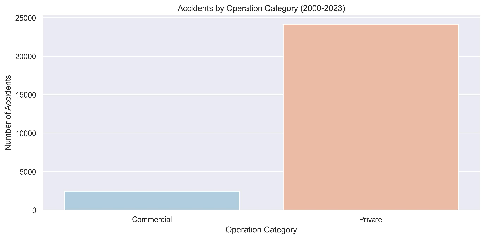

# **Project Title: Aircraft Risk Assessment for Business Expansion**
### **Author:** Patrice Okoiti

## **Overview**
For this project, I will use data cleaning, imputation, analysis, and visualization to generate insights in the aviation industry for a business stakeholder looking to diversify operations.

## **Data Understanding**
The selected Dataset for our analysis is AviationData.csv from the National Transportation Safety board deatailing the civil aviation accidents and selected incidents in the United States and international waters between 1962 and 2023. It details aircraft accidents, including information on accident, aircraft specifications, weather conditions, and injury severity which are relevant to our analysis.

### **column description**
| **Columns** | **Description** |
|-------------|-----------------|
| Event Id, Accident Number, Event Date, Location, Country, Latitude, Longitude, Airport Code, Airport Name | Unique identifiers for each accident and its location. |
| Make, Model, Aircraft Category, Amateur Built, Number of Engines, Engine Type | Details about the aircraft involved in the accident. |
| Injury Severity, Aircraft Damage, Weather Condition, Broad Phase of Flight | Risk factors contributing to the accident. |
| FAR Description, Schedule, Purpose of Flight, Air Carrier | Type of operations and flight purpose. |
| Total Fatal Injuries, Total Serious Injuries, Total Minor Injuries, Total Uninjured | Casualties per accident. |

*Features:* The most important features relevant to our analysis from our dataset include unique identifiers of aircraft, that is, Make, Model, Date and risk factors associated with aircraft accidents, that is, Weather Conditions, Broad phase of flight

*Target:* The target audience for this analysis is a business stakeholder looking to diversify operations into the aviation industry, particularly in private and commercial flights operations

## **Business problem**
Our company is diversifying their portfolio by venturing into the aviation industry. The aim is to purchase and operate aircraft for commercial and private enterprises. However, aviation involves significant safety risks, including accidents and operational hazards. The goal of this project is to analyze historical aircraft accident data to identify low-risk aircraft models and key risk factors that could impact operations.

## **Objectives**
1. Identify the aircract models with lowest accidents rate - This will involve analyzing the number of accidents based on aircraft 'Make' and 'Model' to determine the aircraft with the lowest risk of accidents.
2. Identify risk factors contributing to aircraft accidents - This will involve tracking accident trends over the last 23years and weather conditions, broad phase of the aircraft, for example landing or taking off, as risk factors contributing to accident.
3. Evaluate flight risks based on operations - Compare number of accidents between private commercial flight operations by analyzing Category of Purpose column to determine safer operational choices.

## **Method of Analysis**
1. Descriptive Statistics: Summarizing the accident counts based on aircraft type and accident trend overtime.
2. Data visualisation: Use of bar charts and line charts to analyse accident rates per aircraft.
3. Risk Assessment: Analyze risk factors associated with number of accidents of the aircrafts.

## **Key Findings**

1. The following chart shows the safest aircrafts based on lowest number of accidents for private and commercial flights to be prioritized:

2. The following chart shows that most accidents occurred under VMC(Visual Meteorological Conditions) to suggest that weather is not the primary risk factor associated with accidents but rather human error and possibly mechanical issues:

3. The following chart shows that venturing into private flight operations is riskier than commercial flights operations:

## **Conclusion**

1. Prioritize Safe Aircraft Models: Invest in those with low accident and fatality rates.
2. Enhance Pilot Training: Since most accidents happen in clear weather, focus on human error reduction.
3. Aircraft service: Establish guideline on the level of service required to minimize mechanical issues
3. Operations: Prioritize commercial flights and gradually progress to private flights based on profits and further research

